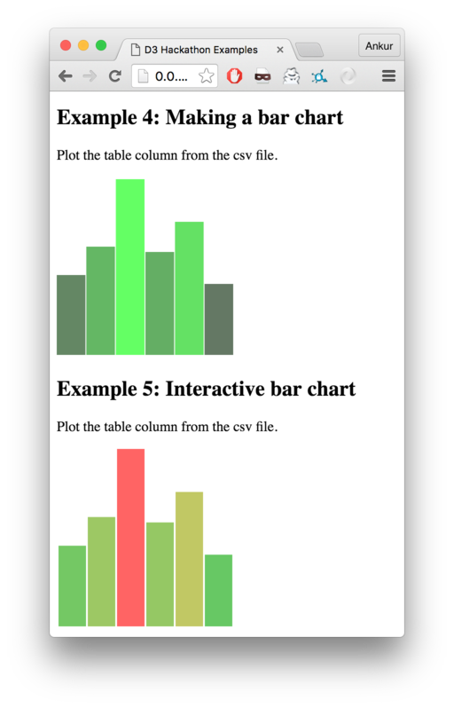

# D3.js LaNT Hackathon

This tutorial and starter kit is intended for data scientists or people with similar background. We expect that you know R, Python, or a similar programming language. This tutorial was designed for [LaNT Hackthon](http://lanthack.org).

## Introduction
To be able to create [D3](https://d3js.org/) web pages, you will need to know 
HTML, CSS, Scalable Vector Graphics (SVG), and JavaScript (JS). Don't worry, this tutorial is here to help you get a quick start. To get inspired, see these amazing web pages:

1. [D3js Gallery](https://d3js.org/)
2. [Visualizing Algorithms using D3](https://bost.ocks.org/mike/algorithms/)

## Tutorial Aims
There are tons of resources available on the web to learn D3. In this tutorial, we have attempted to distill the essence from various sources so that even an absolute beginner (in web development) can start to develop using D3. We hope that you are familiar with at least one programming language, preferably, Python. This repository provides a _starter kit_ that contains code, basic examples, and instructions to get you started.

## Getting Started

#### What is D3.js?
D3.js is a JavaScript library. In fact, it's simply one file of JavaScript code that contains a bunch of useful functions. Take a look [here](https://d3js.org/d3.v3.js). It's not that scary. JavaScript itself is a programming language, much like Python with some C-like constructs. If you know Python, you don't need to spend a lot of time learning JavaScript to start working with D3. As an analogy, JavaScript is to D3 as Python is to matplotlib. 

D3.js is not the only JS library that does data visualization. Checkout 
[sigmajs](http://sigmajs.org/) for an amazing way to draw graphs.

## Prerequisites

1. Learn to use Console under [Developer Tools](https://developers.google.com/web/tools/chrome-devtools/?hl=en).
2. Setup a [codepen.io](codepen.io) account and learn to use it. Taking the initial tour when you sign up is recommended.
3. Look through the resources listed below.
4. Clone this repository and look at examples. See the starter kit section below. Make sure you can fully load the `example.html` page in a web browser. 
5. Try out some JS coding in `custom.js` file and see the changes in `index.html`.


#### Awesome Resources

###### Interactive Data Visualization for the Web: book by Scott Murray
There is an awesome, **free-to-read online**, and surprisingly short [book](http://chimera.labs.oreilly.com/books/1230000000345) on D3 by Scott Murray. There is even a GitHub [repository](https://github.com/alignedleft/d3-book) containing the sample code used in this book! Thank you, Scott! 

If you have the time, read the entire book; it's great. But, if you're short on time, you can skip Chapter 1. If you're looking for context and background on D3, read up [Chapter 2](http://chimera.labs.oreilly.com/books/1230000000345/ch02.html), but you can skip it too if you don't care. [Chapter 3](http://chimera.labs.oreilly.com/books/1230000000345/ch03.html) describes web fundamentals (HTML, CSS, JS, SVG) and you should at least skim it if you're a total beginner to web technologies. This [great intro](https://square.github.io/intro-to-d3/web-standards/) also provides a sort of equivalent but more concise introduction to web fundamentals. We recommend that you at least take a look at the [SVG section](http://chimera.labs.oreilly.com/books/1230000000345/ch03.html#SVG_3). The remaining chapters describe how to setup everything and how to use D3. This starter kit sets up D3 for you.


###### Data Visualization and D3.js: Udacity course
There is an [awesome course](https://www.udacity.com/course/data-visualization-and-d3js--ud507) on D3 at Udacity, complete with video lectures, quizzes, and projects. This is a 7-week course at the rate of 6 hours/week. It's a great course to complete on your own time, but not during the hackathon. If you feel that you are already ready to get started, then you don't need to look into this course. But, for those who prefer video lectures to reading a book, we list below only the essential lectures to give you a quick start.

The [Up and Down the Visualization Spectrum](https://classroom.udacity.com/courses/ud507/lessons/3068848585/concepts/30952087320923) lecture provides good context and background. Feel free to skip this if you don't care. 
The second lesson titled [D3 Building Blocks](https://classroom.udacity.com/courses/ud507/lessons/3168888599/concepts/30952087390923) starts with Developer Tools, downloading and setting up D3, working with JS console, and moves on details on D3. We recommend you take a look at this lesson and learn concepts as you require them. These video lectures also serve as a great reference resource when you get stuck. 

###### Other references
Once you have looked through the basics, the following quick references can offer a lot of help.

1. [Official d3 Wiki](https://github.com/d3/d3/wiki)
2. http://website.education.wisc.edu/~swu28/d3t/concept.html
3. For JS objects, reading files: http://learnjsdata.com/read_data.html
4. [Extra credit] Add synchronous behavior using [D3 Queue](https://github.com/d3/d3-queue).

## Starter Kit
This repository contains the following files. You should clone this repository to your local machine.

```
.
├── README.md
├── custom.js
├── diamonds.csv
├── examples.custom.js
├── examples.html
└── index.html
```

We recommend that you start with the `examples.html` file. You can simply open this file in a browser and see a few examples we have created to get you started. 



Open the Console to see some very helpful messages. Note that it is possible that you this page does not load JS for you because of security issues. You can simply start a HTTP server and avoid this issue.

```bash
# In a shell like bash
# From within the d3js-starter-kit folder
python -m SimpleHTTPServer 8000
```

Now, simply open [http://0.0.0.0:8000/examples.html](http://0.0.0.0:8000/examples.html). Note that `examples.html` file uses `examples.custom.js` to make the examples work. We recommend that you look over the source of these files and use them as reference.

Note that there is no CSS file in this starter kit. The reason is that we want you to focus on D3. Feel free to add your own CSS to your hackathon solution.

We also provide `index.html` and `custom.js` template files for you to put your hackathon solution in. You can simply open `index.html` file in a browser or go to [http://0.0.0.0:8000](http://0.0.0.0:8000) if you started an HTTP server. As you update these two files, you can simply refresh the browser page to reload the HTML and re-run the JS. 


## Acronyms

DOM - Document Object Model

SVG - Scalable Vector Graphics

D3 - Data-Driven Documents

JS - JavaScript


